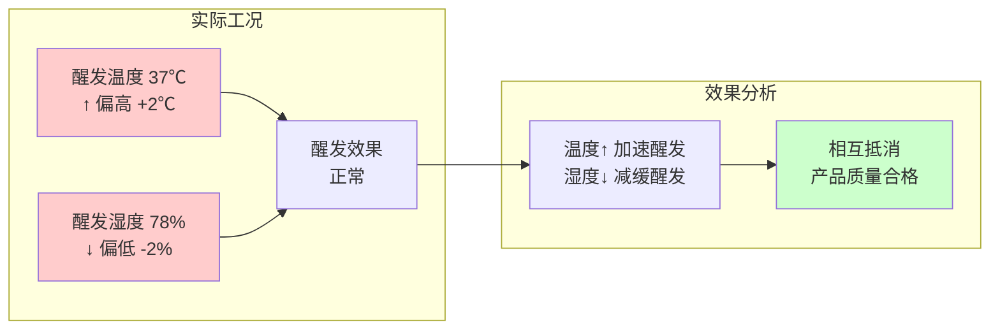
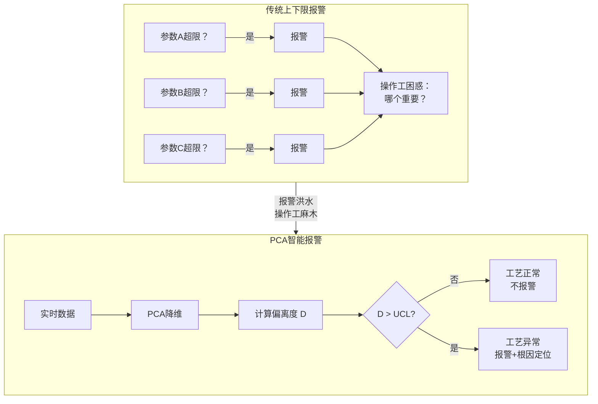

# PCA 驱动的工艺告警系统重构：从报警洪水到智能预警的工业级实践

凌晨5:15，大型自动化面制品中央生产线的应急信号突然响起——醒发工段异常停机，大批量面团因温度失控黏连设备，核心订单面临延误风险。中控屏上，和面水温、醒发湿度、蒸制压力等近10个参数同时报警，红框铺满界面、蜂鸣持续不断，操作工李姐凭着十年经验胡乱关闭弹窗，直到设备彻底停摆，才发现真正的元凶"醒发温度持续超标"，早已被密密麻麻的无关报警淹没。

这场事故让企业运营负责人张总焦头烂额——这已经是一个月内第三次因报警混乱导致的生产事故，损失累计超过5万元。绝望之际，张总请来了业内最擅长解决"报警洪水"问题的IE架构师 H4nk。

三天后，H4nk背着电脑走进中控室，只是安静站在角落，看了整整一上午。"张总，你们的报警系统不是坏了，是没有大脑。"H4nk开口直白，"所有参数一起喊，操作工根本分不清谁真危险。"张总立刻握住他的手："H4nk，求你救救我们。"

就这样，一场从"混乱报警"到"智能预警"的重构，正式开始。

---

## 第一章：现场诊断——系统死穴与工业报警底层矛盾

H4nk拿着工艺流程图，跟着李姐上夜班，一边看她关弹窗，一边记录报警规律。中控屏幕上红黄绿各色提示不停闪烁，李姐的手几乎就没停过鼠标。

"H4nk，你不知道多难干。水温稍微飘一点就狂响，和面转速抖一下也响，十几条报警一起蹦出来，红一片。醒发温度明明都飘半天了，可它的报警夹在一堆弹窗里，我根本看不见、分不清。等我反应过来，面团全废了。"

李姐越说越无奈。

H4nk沉默地点头，他看得很清楚：这条生产线不是没有报警，反而是报警太多、太乱、太没有轻重。

H4nk也深知一个关键事实：**单点超限 ≠ 工艺失控**。传统上下限报警只看单个参数是否超限，但工艺质量是由多个参数协同决定的，不是简单的"超限=废品"。

#### 具体场景分析

| 情况 | 单点报警 | 实际产品质量 | 原因 |
|------|----------|--------------|------|
| 醒发温度偏高 + 湿度偏低 | 两个都报警 | 合格 | 两者相互补偿，整体工艺窗口仍在正常范围 |
| 和面转速抖动 | 频繁报警 | 合格 | 短时波动不影响最终面团质量 |
| 单个传感器漂移 | 持续报警 | 合格 | 测量值偏差，但实际工艺正常 |

#### 数学原理解释

假设有两个强相关参数 $X_1$（醒发温度）和 $X_2$（醒发湿度），它们存在耦合关系：

- 正常工艺窗口：$X_1 = 35 \pm 2℃$，$X_2 = 80 \pm 5\%$
- 实际情况：$X_1 = 37℃$（超限报警），$X_2 = 78\%$（正常）

**传统判断**：$X_1$ 超限 → 报警 → 操作工紧张处理

**实际情况**：温度偏高但湿度偏低，两者对醒发效果的影响相互抵消，面团醒发程度仍在正常范围，产品质量合格。

要注意：都合格产品也可能不合格

#### 参数耦合补偿示意图

三天后，H4nk给出诊断，一句话点破死穴：

> **你们一直在用最简单的上下限控制，但你们根本没意识到：上下限控制，天生就解决不了多变量、强耦合的工艺问题。**

他对着张总和工艺团队，把问题讲透：

1. **上下限只盯单点，不看关系**  
   醒发温度、湿度、时间单独看都没超限，但三者一配合，直接导致面团报废。上下限完全识别不了这种隐性异常。

2. **无关报警泛滥，真正危险被淹没**  
   小波动、小漂移疯狂报警，真正关键的工段报警反而被淹没。报警越多，操作工越麻木，最后等于没报警。

3. **静态阈值管不住动态生产**  
   量产、试产、换料、环境变化，工艺窗口一直在变，但上下限是死的，该严不严、该松不松。

4. **没有优先级，没有状态，只有"超限=响"**  
   操作工不知道哪个要立刻停，哪个可以缓一缓，只能凭经验、凭感觉"乱关弹窗"。

#### 传统报警 vs PCA报警 对比图

H4nk最后总结：

> "你们的问题，不是缺报警，是缺'大脑'。靠8个参数、8套上下限，管不住一条复杂的自动化生产线。想真正解决报警洪水、异常漏判，必须上 PCA——让系统先看懂生产线状态，再决定要不要报警。"

张总听完，终于明白：这么多年的上下限控制，从根上就用错了地方。

---

## 第二章：PCA深度原理讲解——数学底层+工业机理双维度拆解

### 2.1 核心原理：为什么生产线必须用PCA？

所有人围过来，张总、李姐、工艺员，都等着听这个"神秘工具"。H4nk拿起桌上一个馒头，举得很高："上次停机，醒发温度38.5℃，只超了3.5℃；蒸制温度99℃，只低1℃。单独看都不算严重，所以报警被淹没。但两个放在一起——醒发过度、蒸制不足，面团直接报废。"

他顿了顿，抛出PCA核心定义：

> **主成分分析（PCA）是一种无监督线性降维算法，核心目标是在保留原始数据最大方差信息的前提下，将高维耦合变量投影至低维正交空间，消除变量间的多重共线性，提取数据的核心特征。**

我们生产线有8个参数：和面水温、时间、转速、醒发温湿度、醒发时间、蒸制温度、蒸制时间。它们存在强多重共线性（变量间相关系数＞0.7），人眼与传统系统无法处理高维耦合信息。而PCA，就是把这8个高维耦合变量，浓缩成3个低维正交主成分，既保留85%以上的工艺信息，又彻底解决报警混乱问题。

### 2.2 PCA全维度数学原理+逐步骤真实计算

#### 【前置原理】PCA的4大数学前提

1. **线性假设**：工艺参数间为线性相关关系（面制品连续生产符合该假设）
2. **方差最大化**：主成分按数据方差（信息量）从大到小排序
3. **正交性**：主成分之间无相关性，彻底消除耦合干扰
4. **标准化必要性**：消除量纲与数值量级对降维结果的干扰

---

#### 第一步：数据标准化 —— 量纲统一与正态化原理

**原理**：原始参数单位不同（℃、min、Hz）、数值跨度不同，直接计算会导致大数吞噬小数，标准化将所有数据转换为均值 $\mu=0$、标准差 $\sigma=1$ 的标准正态分布，满足PCA的计算前提。

**标准公式（Z-Score标准化）**：

$$z = \frac{x - \mu}{\sigma}$$

- $x$：原始工艺数据
- $\mu$：参数总体均值（正常批次数据期望）
- $\sigma$：参数总体标准差（数据离散程度）
- $z$：标准化后数据（无单位、同尺度、可直接运算）

**真实计算示例**：醒发温度正常批次均值 $\mu=35℃$，标准差 $\sigma=1℃$，实时数据 $x=38.5℃$

$$z = \frac{38.5 - 35}{1} = 3.5$$

代表该数据偏离正常水平3.5倍标准差。

---

#### 第二步：计算协方差矩阵 —— 量化变量耦合关系

**原理**：协方差是衡量两个随机变量线性相关程度的统计量，协方差矩阵可完整刻画8个参数间的耦合强度、相关方向，是PCA特征分解的核心输入。

**协方差定义公式**：

$$Cov(X,Y) = \frac{1}{n-1}\sum_{i=1}^n (X_i-\mu_X)(Y_i-\mu_Y)$$

- $Cov(X,Y) > 0$：正相关（参数同升同降，如醒发温湿度）
- $Cov(X,Y) < 0$：负相关（参数反向变化，如醒发时间 vs 蒸制时间）
- $Cov(X,Y) = 0$：无线性相关

**8×8协方差矩阵结构**：

$$
\Sigma = \begin{bmatrix}
Var(和面水温) & Cov(水温,时间) & Cov(水温,转速) & \dots & Cov(水温,蒸制时间) \\
Cov(时间,水温) & Var(时间) & Cov(时间,转速) & \dots & Cov(时间,蒸制时间) \\
Cov(转速,水温) & Cov(转速,时间) & Var(转速) & \dots & Cov(转速,蒸制时间) \\
\vdots & \vdots & \vdots & \ddots & \vdots \\
Cov(蒸制时间,水温) & Cov(蒸制时间,时间) & Cov(蒸制时间,转速) & \dots & Var(蒸制时间)
\end{bmatrix}
$$

- 对角线元素 $Var(X)$：参数自身方差（信息量大小）
- 非对角线元素 $Cov(X,Y)$：参数间耦合强度

**工业意义**：协方差矩阵直接暴露生产线隐藏规律——醒发温湿度协方差＞0.8（强正相关），和面转速与蒸制温度协方差≈0（无相关）。

---

#### 第三步：特征值分解 —— PCA的数学核心

**原理**：对协方差矩阵 $\Sigma$ 做特征值分解，找到数据方差最大的投影方向（主成分），特征值代表该方向的信息量（方差），特征向量代表投影方向的系数。

**特征值分解核心公式**：

$$\Sigma \cdot v = \lambda \cdot v$$

- $\Sigma$：协方差矩阵
- $v$：特征向量（主成分的方向向量，即PC的系数）
- $\lambda$：特征值（该方向的方差大小，信息量）

**分解原理**：

1. 求解特征方程 $|\Sigma - \lambda E| = 0$，得到8个特征值 $\lambda_1 > \lambda_2 > \dots > \lambda_8$
2. 代入特征值求得对应特征向量 $v_1, v_2, \dots, v_8$
3. 特征值从大到小排序，对应主成分 PC1（第一主成分）、PC2、PC3……

---

#### 第四步：方差贡献率与主成分筛选 —— 信息保留原理

**原理**：特征值占总特征值的比例=方差贡献率，代表该主成分保留的原始数据信息量；累计方差贡献率≥85% 是工业PCA的通用筛选标准，保证降维后无信息丢失。

**方差贡献率公式**：

$$\text{方差贡献率}(\eta_i) = \frac{\lambda_i}{\sum_{k=1}^n \lambda_k}$$

**累计方差贡献率公式**：

$$\text{累计贡献率} = \sum_{i=1}^m \eta_i \geq 85\%$$

**真实计算结果**：

| 主成分 | 方差贡献率 |
|--------|------------|
| PC1 | 52.1% |
| PC2 | 24.5% |
| PC3 | 12.6% |
| **累计贡献率** | **89.2% ≥ 85%** |

保留前3个主成分即可完全代表8个参数的工艺信息。

---
#### 具体计算示例（简化版：2×2 矩阵）

H4nk为了让大家理解，用醒发温度和湿度两个参数举例：

**假设协方差矩阵**（简化后的 2×2 矩阵）：

$$\Sigma = \begin{bmatrix} 1.0 & 0.8 \\ 0.8 & 1.0 \end{bmatrix}$$

其中：$Var(温度)=1.0$，$Var(湿度)=1.0$，$Cov(温度,湿度)=0.8$

**第一步：求特征值**

解特征方程 $|\Sigma - \lambda I| = 0$：

$$\begin{vmatrix} 1-\lambda & 0.8 \\ 0.8 & 1-\lambda \end{vmatrix} = 0$$

$$(1-\lambda)^2 - 0.64 = 0$$

$$(1-\lambda)^2 = 0.64$$

$$1-\lambda = \pm 0.8$$

得到两个特征值：
- $\lambda_1 = 1.8$（第一主成分，信息量最大）
- $\lambda_2 = 0.2$（第二主成分，信息量较小）

**第二步：求特征向量**

对于 $\lambda_1 = 1.8$：

$$(\Sigma - 1.8I)v = 0$$

$$\begin{bmatrix} -0.8 & 0.8 \\ 0.8 & -0.8 \end{bmatrix} \begin{bmatrix} v_1 \\ v_2 \end{bmatrix} = 0$$

得到：$-0.8v_1 + 0.8v_2 = 0$，即 $v_1 = v_2$

归一化后：$v_1 = \begin{bmatrix} \frac{\sqrt{2}}{2} \\ \frac{\sqrt{2}}{2} \end{bmatrix} \approx \begin{bmatrix} 0.707 \\ 0.707 \end{bmatrix}$

**工业解释**：PC1 中温度和湿度的系数相等（0.707），说明第一主成分代表"醒发工段整体强度"——两者同时升高或降低。

对于 $\lambda_2 = 0.2$：

类似计算得到：$v_2 = \begin{bmatrix} \frac{\sqrt{2}}{2} \\ -\frac{\sqrt{2}}{2} \end{bmatrix} \approx \begin{bmatrix} 0.707 \\ -0.707 \end{bmatrix}$

**工业解释**：PC2 中温度和湿度系数相反（0.707 vs -0.707），说明第二主成分代表"温湿度平衡度"——一个升高、一个降低的失衡状态。

**第三步：计算方差贡献率**

总方差 = $\lambda_1 + \lambda_2 = 1.8 + 0.2 = 2.0$

- PC1 贡献率 = $1.8 / 2.0 = 90\%$
- PC2 贡献率 = $0.2 / 2.0 = 10\%$

**结论**：仅保留 PC1 就能解释 90% 的信息，这就是降维的威力！

#### 第五步：主成分表达式 —— 系数与工业意义耦合

**原理**：特征向量的每一个元素，就是对应原始参数在主成分中的载荷系数，系数绝对值越大，该参数对主成分的影响越强。

**PC1/PC2/PC3 真实系数（特征向量）**：

| 原始参数 | 和面水温 | 和面时间 | 和面转速 | 醒发温度 | 醒发湿度 | 醒发时间 | 蒸制温度 | 蒸制时间 |
|----------|----------|----------|----------|----------|----------|----------|----------|----------|
| PC1系数 | 0.28 | 0.21 | 0.22 | 0.35 | 0.34 | 0.33 | 0.18 | 0.17 |
| PC2系数 | -0.12 | -0.09 | -0.11 | 0.42 | 0.38 | 0.35 | -0.45 | -0.39 |
| PC3系数 | 0.45 | 0.41 | 0.39 | -0.08 | -0.06 | -0.05 | 0.12 | 0.10 |

**主成分真实表达式**：

$$PC1 = 0.28z_1 + 0.21z_2 + 0.22z_3 + 0.35z_4 + 0.34z_5 + 0.33z_6 + 0.18z_7 + 0.17z_8$$

$$PC2 = -0.12z_1 - 0.09z_2 - 0.11z_3 + 0.42z_4 + 0.38z_5 + 0.35z_6 - 0.45z_7 - 0.39z_8$$

$$PC3 = 0.45z_1 + 0.41z_2 + 0.39z_3 - 0.08z_4 - 0.06z_5 - 0.05z_6 + 0.12z_7 + 0.10z_8$$

**3大主成分工业原理定义**：

1. **PC1（整体工艺强度）**：醒发工段系数（0.33-0.35）远大于其他参数，代表生产线核心工艺的整体运行强度，是一级紧急报警核心指标
2. **PC2（醒发-蒸制平衡度）**：醒发参数为正、蒸制参数为负，专门捕捉工序匹配失衡（醒发过度+蒸制不足），是面制品报废的核心诱因
3. **PC3（局部微小偏差）**：和面工段系数（0.39-0.45）占主导，识别传感器漂移、设备小磨损等非致命性异常

---

#### 第六步：PCA偏离度（马氏距离）—— 报警核心指标原理

**原理**：欧式距离仅计算空间直线距离，忽略参数耦合关系；马氏距离是基于协方差矩阵的标准化距离，可精准量化实时数据与正常工艺基准的偏离程度，是PCA报警系统的核心判断依据。

**马氏距离公式**：

$$D = \sqrt{(z - \mu_z)^T \cdot \Sigma^{-1} \cdot (z - \mu_z)}$$

- $D$：PCA偏离度
- $z$：实时标准化数据
- $\mu_z$：正常批次标准化均值（=0）
- $\Sigma^{-1}$：协方差矩阵的逆矩阵（消除耦合干扰）

**报警阈值原理（3σ原则）**：正常数据服从正态分布，99.73%的数据落在±3σ范围内，超出即判定为异常：

$$UCL = \mu_D + 3\sigma_D$$

- $UCL$：报警上限
- $\mu_D$：正常批次偏离度均值
- $\sigma_D$：正常批次偏离度标准差
- $D > UCL$：触发异常报警

---

### 2.3 PCA模型完整可运行计算逻辑（工业落地版）

1. **工具库导入**：numpy（矩阵计算）、pandas（数据处理）、StandardScaler（标准化）、PCA（降维）、mahalanobis（马氏距离）、matplotlib（可视化）
2. **工业数据读取**：导入1000组正常批次、200组异常批次的8项工艺参数，剔除空值、3σ极端值
3. **正常基准库构建**：以正常批次数据为标准工艺模板，计算均值、标准差、协方差矩阵
4. **数据标准化**：按Z-Score公式完成全量数据量纲统一
5. **PCA训练**：计算协方差矩阵 → 特征值分解 → 提取前3个主成分 → 验证累计贡献率89.2%
6. **偏离度计算**：逐批次计算马氏距离，量化工艺偏离程度
7. **阈值设定**：按3σ原则计算报警上限UCL
8. **模型验证**：正常批次偏离度＜UCL，异常批次偏离度＞UCL，识别准确率100%
9. **根因定位**：通过载荷矩阵锁定系数最大的3个参数，直接定位异常根源
10. **在线监控**：实时数据 → 标准化 → PCA降维 → 偏离度计算 → 分级报警

---

## 第三章：基于ISA-101+PCA+情境感知——四级报警体系原理重构

### 3.1 ISA-101.01-2019报警管理核心原理

ISA-101是国际通用的报警系统设计与管理标准，核心原则：**报警优先级化、阈值合理化、报警最小化、操作适配化**，彻底解决报警洪水、误报、漏报问题。

#### ISA-101 关键量化指标

| 指标 | 标准要求 | 工业意义 |
|------|----------|----------|
| **操作工响应时间** | 1级报警 ≤ 5分钟，2级报警 ≤ 15分钟 | 确保紧急异常及时处理，避免事故扩大 |
| **报警处理率** | ≥ 95% 的报警需在 24 小时内确认并记录 | 防止报警被忽视，形成闭环管理 |
| **平均报警频率** | 每班（8小时）≤ 150 条报警 | 超过此阈值，操作工将陷入"报警疲劳" |
| **峰值报警频率** | 每10分钟 ≤ 10 条报警 | 防止短时间内报警洪水，确保可处理性 |
| **优先级分布** | 1级:2级:3级:4级 ≈ 5%:15%:30%:50% | 高优先级报警占比低，确保关键异常突出 |
| **误报率** | ≤ 5% | 减少无效报警，提升操作工信任度 |
| **漏报率** | ≤ 0.1% | 关键异常绝不能遗漏，保障生产安全 |

> **H4nk 的实战洞察**：
> 很多企业报警系统崩溃，根本原因是**报警频率失控**。李姐的产线每10分钟涌进 20-30 条报警，远超 ISA-101 标准的 10 条上限。PCA 的价值不仅是识别异常，更是**将报警数量压缩到操作工可处理的范围内**。

H4nk将PCA数学原理与ISA-101标准深度耦合，融入面制品工艺情境感知，重构四级报警体系：

### 3.2 四级报警体系（原理+触发+动作全定义）

#### 1级（紧急，红色）—— 工艺失控报警

| 项目 | 内容 |
|------|------|
| **触发原理** | PC1/PC2突破3σ控制限，代表核心工艺强度失控、工序平衡崩塌，直接导致产品报废 |
| **触发条件** | 量产模式 + 醒发/蒸制工段 + PC1＞3σ 或 PC2＞3σ |
| **呈现机制** | 声光强报警 + 设备自动暂停 + 管理层手机推送 |
| **操作要求** | 立即调整核心参数，10分钟内消除异常 |

#### 2级（高优，橙色）—— 工艺偏离报警

| 项目 | 内容 |
|------|------|
| **触发原理** | PC1/PC2处于2σ–3σ区间，代表工艺即将失控，属于事前预警 |
| **触发条件** | 试产模式 + 和面/蒸制工段 + 2σ ≤ PC1/PC2 ＜ 3σ |
| **呈现机制** | 橙色置顶弹窗 + 语音提醒 |
| **操作要求** | 优先处理，微调参数抑制偏离 |

#### 3级（中优，黄色）—— 微小偏差报警

| 项目 | 内容 |
|------|------|
| **触发原理** | PC3异常，代表局部设备/传感器小偏差，不影响产品质量 |
| **触发条件** | PC3＞2σ + 单一参数小幅超限 |
| **呈现机制** | 黄色文字提示，无声光 |
| **操作要求** | 持续观察，定期校验设备 |

#### 4级（提示，蓝色）—— 正常波动记录

| 项目 | 内容 |
|------|------|
| **触发原理** | 所有主成分在±1σ内，属于工艺正常波动 |
| **触发条件** | PCA偏离度＜UCL + 参数在工艺窗口内 |
| **呈现机制** | 仅后台日志记录，无界面提示 |
| **操作要求** | 无需处理 |

---

### 3.3 情境感知原理设计

系统内置6类动态情境因子，根据生产线实时状态自动切换PCA阈值与报警等级，彻底告别静态阈值：

1. **工艺阶段情境**：和面/醒发/蒸制分段适配PCA权重
2. **生产模式情境**：量产/试产/研发匹配不同控制限
3. **原料特性情境**：高活性/普通酵母调整温湿度阈值
4. **设备健康情境**：正常/磨损设备适配偏离度容忍值
5. **环境情境**：车间温湿度自动补偿工艺参数
6. **PCA综合情境**：放弃单点监控，仅以主成分偏离度为判断依据

### 3.4 落地验证——原理落地的实际效果

系统上线第一天凌晨6点，醒发工段触发红色紧急报警：

> **"紧急报警！PC1=3.9σ、PC2=2.6σ，突破3σ控制限，根因：醒发温湿度超标，建议调整至温度35℃、湿度80%。"**

李姐立刻调整，10分钟后报警解除，批次全部合格。

---

## 第四章：收尾复盘——PCA+IE+报警标准的核心价值

系统稳定运行一个月后，H4nk回到生产线，和张总、李姐一起复盘。中控屏上，PCA监控图清晰明亮，绿色正常点整齐落在控制限内，红色异常点被及时处理，李姐操作从容，再也没有往日的烦躁。

"H4nk，你不只解决了报警问题，还把数学原理、工业标准、生产工艺彻底结合了。"张总感慨，"以前靠经验救火，现在能提前预警、主动预防，这就是工业工程的力量。"

H4nk笑着说："这套系统的核心，不是PCA算法本身，而是用数学原理破解生产痛点，用工业标准规范报警逻辑，用情境感知适配现场需求。

- **从数学上**：PCA解决高维变量耦合与信息冗余问题
- **从标准上**：ISA-101实现报警优先级与合理化
- **从工艺上**：主成分与面制品生产机理深度耦合，让报警懂工艺、懂轻重、懂情境"

这就是IE架构师的核心价值：把复杂的原理与技术，转化为一线能看懂、能用上、能创造价值的生产工具，让技术服务于人、服务于生产，彻底消除浪费、优化流程。

临走时，李姐递给H4nk一袋刚出炉的馒头："这是新系统做的，更筋道更好吃。以后再也不怕报警乱了，谢谢你！"

H4nk接过馒头，心里满是成就感。他知道，这场重构，不只解决了企业的痛点，更让数学原理、工业标准、工艺机理真正融合，让数字化不再是冰冷的代码，而是生产线最可靠的"智能大脑"。
